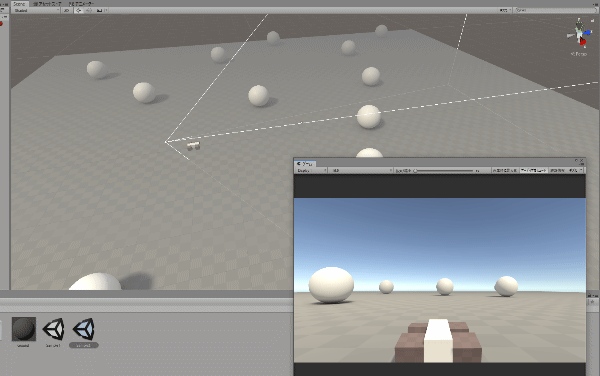

# Unity_Wheel_Collider_Tutoriald

[Wheel Collider チュートリアル](https://docs.unity3d.com/ja/current/Manual/WheelColliderTutorial.html) で紹介されているコードを利用した、非常に簡単な車のでデモです。

カメラワークにCinemachineを使用しています。

`Unity 2018.4.2` で作成されました。
